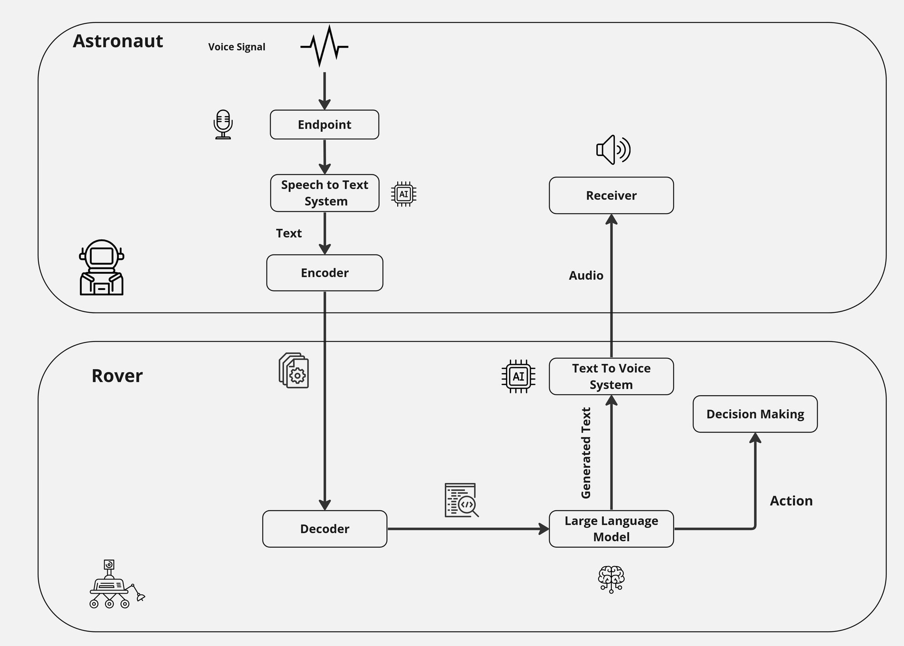

  

<h3 align="center">Human Exploration Rover Challenge (HERC)</h3>

 Facilitating communication between a rover and astronauts using voice technology and implement computer vision to classify rocks .
      

## 📝 Table of Contents

- [About](#about)
- [Getting Started](#getting_started)
- [Solutions to HERC Objectives](#Solutions%to%HERC%Objectives)
  - [Rock Classification Project](#Rock%Classification%Project)
  - [Voice Recognition Project](#Voice%Recognition%Project)
  - [Text-to-Speech (TTS) Project](Text-to-Speech%(TTS)%Project)

- [Overall Impact](Overall%Impact)
- [What's Next](#What's%Next)

## 🧐 About 

This project integrates three key sub-projects: rock classification, voice recognition, and text-to-speech (TTS) to enable voice-based communication between a rover and astronauts.

## 🏁 Getting Started 

## Solutions to HERC Objectives

### 1. Rock Classification Project

The rock classification module plays a crucial role in addressing HERC objectives, particularly in scenarios like Mars Sample Collection. By employing advanced image processing and machine learning techniques, our rock classification project enables the rover to autonomously identify and categorize rocks on the Martian surface. This capability enhances the rover's ability to collect samples efficiently while navigating through the rugged terrain of celestial bodies. [More Details](Rock%20classification/README.md)

### 2. Voice Recognition Project

Voice recognition is a key component that directly aligns with HERC's emphasis on human-powered rovers and intricate mission tasks. Our voice recognition module allows astronauts to communicate with the rover using spoken commands, facilitating real-time control and interaction. This feature proves invaluable in scenarios like Deep Space Missions, where limited communication with Earth demands efficient and intuitive communication between astronauts and the rover.[More Details](SpeechRecognition/Training/README.md)

### 3. Text-to-Speech (TTS) Project

The TTS module contributes to achieving HERC goals by addressing challenges related to resource sustainability and efficient data collection. In scenarios like Lunar Resource Exploration, where the rover needs to identify and extract valuable lunar resources, the TTS functionality allows the rover to communicate findings and status updates audibly. This promotes effective collaboration between the rover and astronauts, optimizing resource utilization in lunar environments.[More Details](TextToSpeech(TTS)/README.md)

## Overall Impact

By integrating these three projects, our voice-enabled rover communication system strives to excel in HERC missions, offering innovative solutions that enhance mobility, scientific accuracy, and resource sustainability. Through rock classification, voice recognition, and text-to-speech capabilities, our project aligns with the HERC vision of inspiring innovation in aerospace engineering and addressing real-world challenges in space exploration.
 
 ## What's Next

### Implementing LLms and Generative AI

Our ongoing development roadmap includes the implementation of LLMs and generative artificial intelligence (AI) to enhance the capabilities of our voice-enabled rover communication system. These advanced technologies will contribute to the project's evolution in the following ways