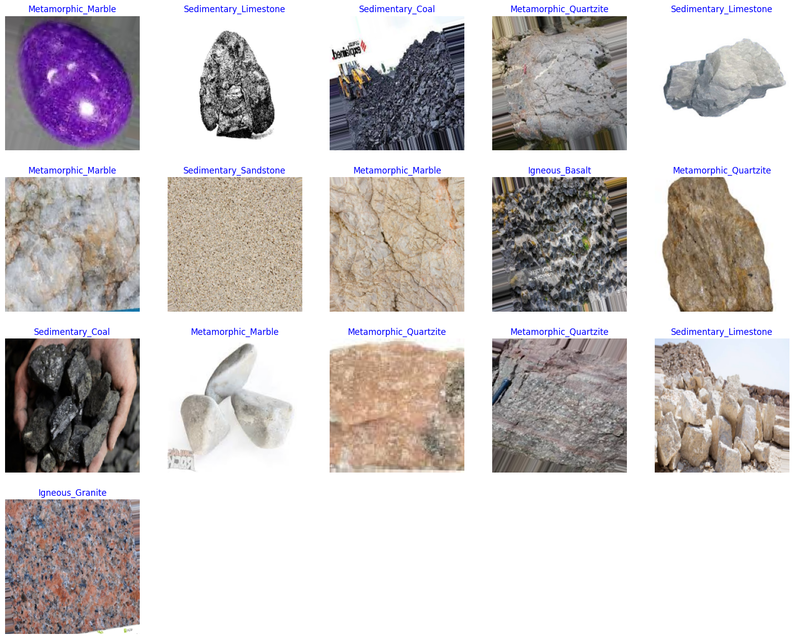

<p align="center">
  <a href="" rel="noopener">
  </a>
</p>

<h3 align="center">Rock Classification with Deep Learning</h3>

Rock Classification Project, a cutting-edge initiative that harnesses the power of deep learning to classify rocks based on image data. In the vast expanse of the cosmos, particularly on extraterrestrial terrains explored by rovers, understanding the composition of rocks is crucial for unraveling the mysteries of the universe. This project addresses this challenge by employing advanced image processing techniques, enabling rovers equipped with cameras to scan and classify rocks with unprecedented accuracy.

The primary objective of this project is to develop a robust rock classification system capable of distinguishing various rock types based on visual features captured by rover cameras. By leveraging deep learning algorithms, the system can learn intricate patterns and characteristics inherent to different rock formations, contributing to our understanding of celestial bodies and their geological compositions.

The codebase comprises specialized modules meticulously designed to handle diverse aspects of the project:

- **Data Handling:** The project incorporates modules for efficient data handling, allowing the organization and processing of large datasets containing rock images. With meticulous attention to detail, the system generates dataframes, splits data into training, validation, and test sets, and prepares the dataset for model training.

- **Model Creation:** The heart of the project lies in the creation of a powerful deep learning model. Leveraging state-of-the-art techniques, the system utilizes a Convolutional Neural Network (CNN) architecture to extract intricate features from rock images. The model is designed to recognize and categorize rocks with high precision, enabling accurate classification even in the challenging conditions of outer space.

- **Training and Evaluation:** The project includes mechanisms for training the model using a carefully curated dataset. The training process involves epochs, batches, and sophisticated optimization algorithms to enhance the model's predictive capabilities. The evaluation phase rigorously assesses the model's performance, utilizing metrics such as accuracy, loss, and visualizations like confusion matrices to provide insights into the model's efficacy.

- **Model Saving:** Once trained and evaluated, the model can be saved for future use. This is a crucial aspect for real-world applications where models need to be deployed on rovers or other space exploration devices, ensuring the preservation of learned knowledge for continued use.

This project, with its innovative approach to rock classification, not only pushes the boundaries of artificial intelligence in space exploration but also lays the foundation for future missions seeking to understand the geological composition of celestial bodies. As we embark on this cosmic journey, the Rock Classification Project stands as a testament to the fusion of technology and exploration, propelling humanity further into the mysteries of the cosmos. </p>

## 📝 Table of Contents

- [Modules](#modules)
- [Functions](#functions)
  - [Create Data Frame from Dataset](#create-data-frame-from-dataset)
  - [Generate Images from DataFrame](#generate-images-from-dataframe)
  - [Display Data Sample](#display-data-sample)
  - [Callbacks](#callbacks)
  - [Plot Training History](#plot-training-history)
  - [Create Confusion Matrix](#create-confusion-matrix)
- [Model Structure](#model-structure)
- [Start Reading Dataset](#start-reading-dataset)
- [Generic Model Creation](#generic-model-creation)
- [Set Callback Parameters](#set-callback-parameters)
- [Train Model](#train-model)
- [Display Model Performance](#display-model-performance)
- [Evaluate Model](#evaluate-model)
- [Get Predictions](#get-predictions)
- [Confusion Matrix and Classification Report](#confusion-matrix-and-classification-report)
- [Save Model](#save-model)
- [Thank You](#thank-you)


## 📝 Modules

```python
# Import needed modules
import os
import time
import shutil
import itertools
import cv2
import numpy as np
import pandas as pd
import seaborn as sns
import matplotlib.pyplot as plt
import tensorflow as tf
from tensorflow import keras
from tensorflow.keras.layers import Conv2D, MaxPooling2D, Flatten, Dense, Activation, Dropout, BatchNormalization
from tensorflow.keras.models import Model, load_model, Sequential
from tensorflow.keras.preprocessing.image import ImageDataGenerator
from sklearn.metrics import confusion_matrix, classification_report
from sklearn.model_selection import train_test_split
from tensorflow.keras.optimizers import Adam, Adamax
from tensorflow.keras import regularizers
from tensorflow.keras.metrics import categorical_crossentropy
import warnings
warnings.filterwarnings("ignore")
print ('modules loaded')
```

## 📝 Functions


### Generate Images from DataFrame

</a>

**Dataset Source** : [Kaggle](https://www.kaggle.com/datasets/salmaneunus/rock-classification/data)

## 📝 Model Structure
</a>


### Plot Training History

</a>


## 📝 Display Model Performance

</a>


## 📝 Confusion Matrix and Classification Report

</a>

## 📝 Save Model

**You can find the in models folder**